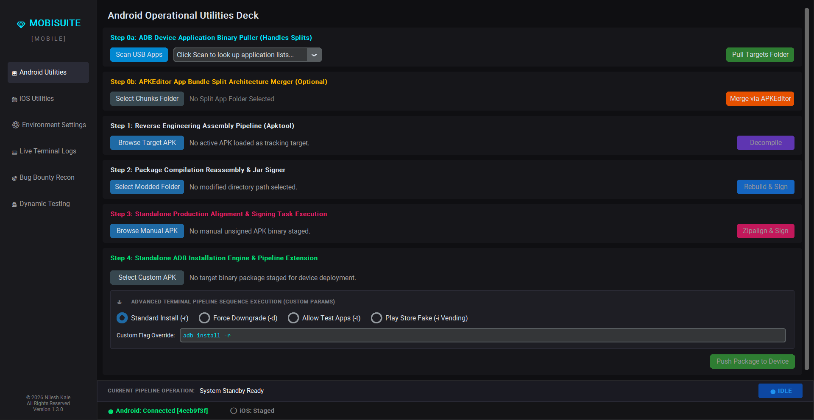
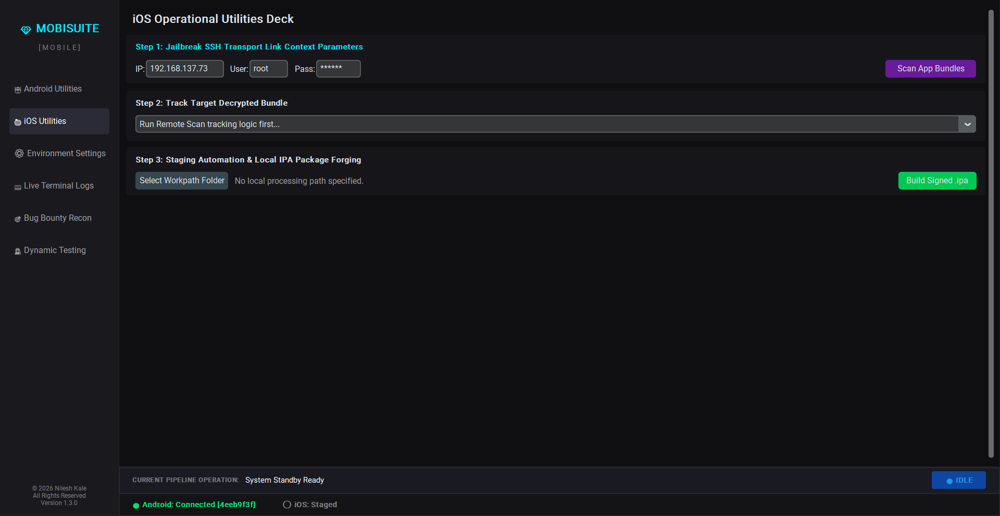
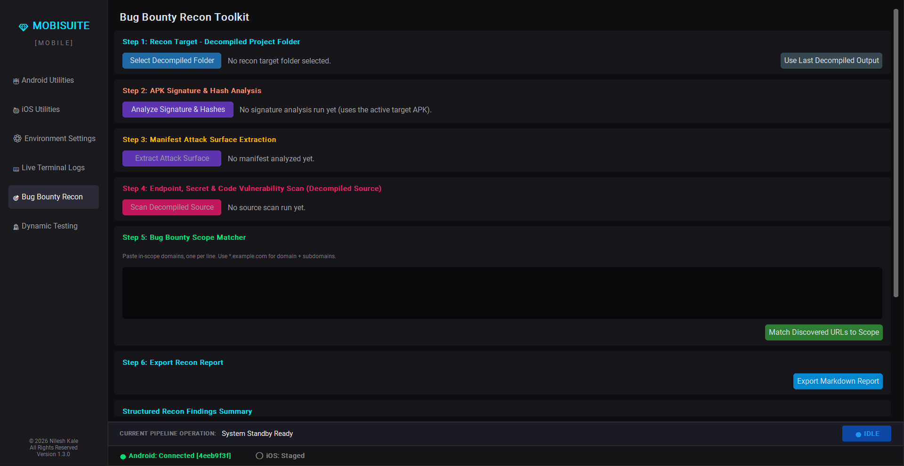
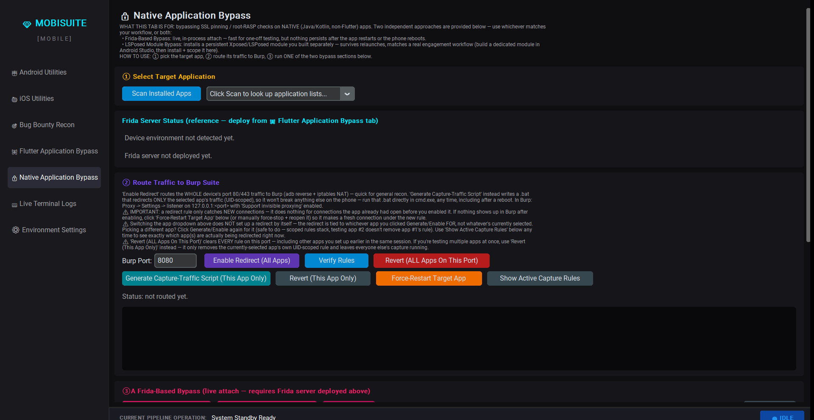
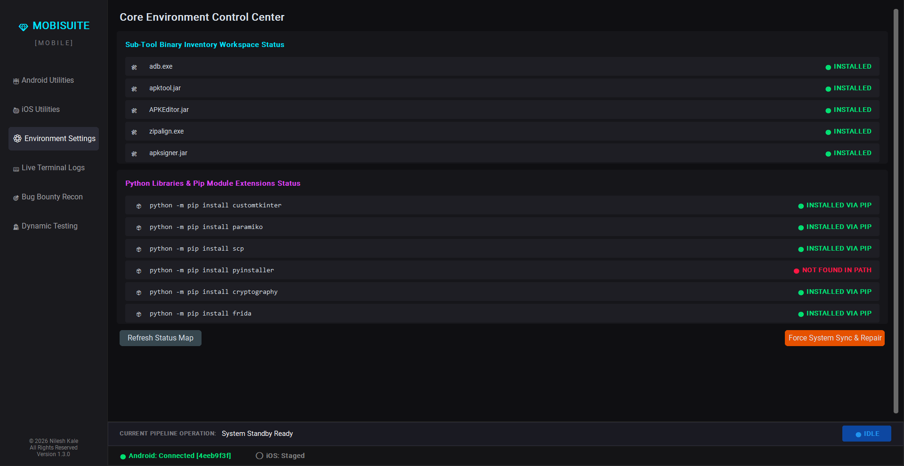
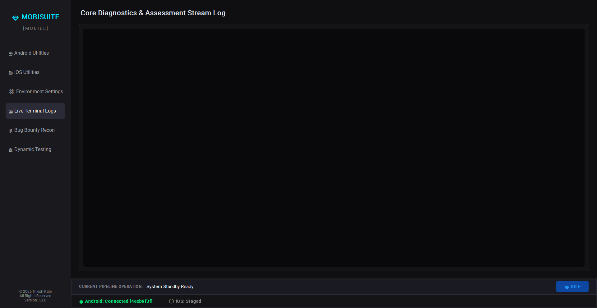

# 💎 MobiSuite v1.3.0

MobiSuite is a cross-platform, multi-threaded GUI pipeline engine designed for mobile application security analysts, penetration testers, and reverse engineers. It replaces complex, repetitive command-line workflows with a streamlined, click-driven interface to automate the extraction, modification, assembly, signing, and deployment of Android (APK/APKS) and decrypted iOS (IPA) application binaries.

---

## 📸 Screenshots

| Android Utilities | iOS Utilities |
| :---: | :---: |
|  |  |

| Bug Bounty Recon (Static Analysis) | Native/Flutter Application Bypass (Frida) |
| :---: | :---: |
|  |  |

| Environment Settings (Tool Inventory) | Live Terminal Logs |
| :---: | :---: |
|  |  |

> Screenshots reflect an earlier build. The dynamic-testing deck pictured has since been split into two dedicated tabs — 🦋 **Flutter Application Bypass** and 🔒 **Native Application Bypass** — which also added Burp traffic routing and a persistent LSPosed module workflow described below.

---

## 🚀 What Our Tool Does & How It Works

MobiSuite bridges the gap between raw command-line tools and modern GUI accessibility. Behind the scenes, it manages an asynchronous execution environment that safely orchestrates industry-standard utilities, ensuring your GUI never freezes while performing heavy cryptographic or file-system tasks. 

### 🛠️ Core Use Cases & Updated Features

* **Automated Reverse Engineering (Decompile & Rebuild):** 
  Instantly unpackages Android APK structures down to readable Smali source code, `AndroidManifest.xml` files, and raw assets using `apktool`. Once your security modifications are complete, the pipeline automatically rebuilds the directory back into an unsigned package.
* **Split APK Bundle Merging:** 
  Modern Android apps are often delivered as fragmented App Bundles (`base.apk` + DPI/Language config splits). MobiSuite natively calls `APKEditor` to seamlessly unify these multi-component architectures into a single standalone binary for frictionless static analysis.
* **Cryptographic Signing & Boundary Optimization:** 
  No need to memorize keystore passwords or alignment bytes. The suite automatically handles package byte-alignment via `zipalign` and applies certified debugging signatures using `apksigner` so the operating system accepts your modified package.
* **Advanced Native ADB Installer Console (NEW):** 
  Features a dedicated standalone console to sideload custom or rebuilt APKs directly to connected physical devices. It includes dynamic command presets for:
  * *Standard Installs* (`-r`)
  * *Force Downgrades* (`-d`) to bypass version constraint conflicts.
  * *Allow Test Apps* (`-t`) 
  * **Play Store Vending Spoofing** (`pm install -i com.android.vending`): Tricks the Android OS into believing the application was officially downloaded and licensed through the Google Play Store, effectively bypassing source-installation restrictions.
* **Decrypted iOS Storage Pulling & Smart Pathing (NEW):** 
  Creates a secure SSH tunnel to remote jailbroken iOS devices to locate, pull, and automatically forge decrypted `.app` containers into raw, distributable `.ipa` binaries. 
  * *String Sanitization Engine:* Automatically strips problematic escaped shell slashes and handles spaces in remote folder names (e.g., smoothly resolving `Apple\ Store.app`).
  * *Windows Long-Path Bypass:* Natively utilizes Windows Extended Paths (`\\?\`) to safely bypass the strict 260-character Windows folder limit during deep recursive file system pulls, preventing crashes when saving to nested OneDrive or enterprise project folders.
* **Live Environmental Auditing:** 
  Actively monitors connected physical hardware via background ADB/SSH transport loops, tracking device IDs and IP endpoints dynamically on a unified bottom HUD.
* **Bug Bounty Recon Toolkit (Static Analysis):** 
  A dedicated deck for mobile bug bounty and MobSF-style static workflows built on top of a decompiled apktool project. Extracts the manifest attack surface (exported components, dangerous permissions, deep links), mines the smali/res/assets tree for hardcoded URLs, IP addresses, leaked API keys/secrets, and MobSF-style code vulnerability patterns (weak crypto, insecure WebView config, broken TrustManager/HostnameVerifier, insecure randomness), analyzes the APK's signing certificate (v1/v2/v3/v4 scheme verification, signer DN, debug-cert detection) and file hashes (MD5/SHA1/SHA256), and matches discovered endpoints against a pasted bug bounty program scope list — then exports the whole thing as a Markdown report.
* **Flutter Application Bypass (NEW):** 
  Flutter apps bundle their own BoringSSL-based TLS stack inside `libflutter.so`, so generic Java-layer SSL pinning bypasses do nothing against them. This tab extracts `libflutter.so` (arm64-v8a) straight from the APK, statically scans the ELF code segment for the certificate-verify function (via `ssl_client`/`ssl_server` string-reference analysis, never a hardcoded offset), reports the result honestly as `CONFIDENT`, `AMBIGUOUS`, or `NOT_FOUND`, then generates and attaches a Frida script that hooks the resolved offset live — with real-time hook-hit-count confirmation so you know the bypass actually fired, not just that it loaded.
* **Native Application Bypass — Frida + Persistent LSPosed Module (NEW):** 
  Two independent bypass approaches for native (Java/Kotlin) apps: a **Frida-based live attach** (curated SSL-pinning-bypass and root-detection-bypass scripts, or load your own custom `.js` for bespoke logic — fast, but nothing survives an app restart or reboot), and a **persistent LSPosed/Xposed module workflow** (install a module APK you built separately, then enable and scope it directly to the target app by writing into LSPosed's own `modules_config.db` via `adb` + `sqlite3` — survives relaunches and reboots once the module is scoped).
* **Traffic Routing to Burp Suite (NEW):** 
  Interception is now built directly into both bypass tabs. Route the whole device's port 80/443 traffic to Burp with one click (`adb reverse` + iptables NAT), or generate a standalone, UID-scoped `.bat` script that redirects only the selected app's traffic — safe to keep and re-run any time (including after a device reboot) without the GUI. Includes rule verification, per-app or all-app revert, a one-click force-restart of the target app (so it opens a fresh connection under a newly added redirect rule), and a live view of exactly which app(s) are currently being redirected.

---

## 🔬 Technical Architecture & Specifications

### System Requirements
* **Supported OS:** Kali Linux / Ubuntu, Windows 10/11, macOS
* **Runtime Core:** Python 3.10+
* **Dependencies Node:** Java Runtime Environment (JRE) / JDK 8+ (Required for binary assembly and signing tools)

### Toolset Blueprint & Binaries Inventory
MobiSuite maps and isolates the following industry-standard utility binaries into a dedicated localized directory structure:

| Binary Component | Purpose / Specification | Integration Layer |
| :--- | :--- | :--- |
| `adb` | Android Debug Bridge subsystem connection loop & package sideloading | Hardware HUD & Installer Console |
| `apktool.jar` | Decodes resources to nearly original form and rebuilds them | Step 1 & 2 Android Pipeline |
| `APKEditor.jar` | Merges split bundle architectures (`base.apk` + configurations) | Step 0b Android Pipeline |
| `zipalign` | Provides crucial 4-byte boundary alignment optimizations for resources | Production Alignment Task |
| `apksigner.jar` | Signs APKs with v1, v2, v3, and v4 cryptographic validation schemes | Standalone & Mod Rebuild |
| `frida-server` | Runtime instrumentation daemon, version-matched to the local `frida` package and pushed to the device on demand (cached under `tools/frida-server-cache/`, not bundled) | Flutter/Native Application Bypass Decks |

### Embedded Python Extensions
The following framework layers are validated and maintained automatically by the environment controller upon suite initialization:
* `customtkinter` — High-contrast premium UI rendering layer supporting scrollable window limits.
* `paramiko` — Low-level SSHv2 protocol transport channel management.
* `scp` — Secure Copy Protocol wrapper node for encrypted asset scraping and recursive network pulls.
* `cryptography` — Cryptographic primitives backing `paramiko`'s SSH transport.
* `pyinstaller` — Optional: lets you package the suite into a standalone executable.
* `frida` — Python bindings for runtime instrumentation (SSL pinning / root detection bypass / custom scripts, including the Flutter auto-offset bypass).

## 🚀 Installation & Launch
```
🐉 In Kali Setup Guide

Step 1: Clone the Workspace In Kali with below cmd
      git clone https://github.com/nileshkale12/MobiSuite-Mobile.git

Step 2: Navigate to below dir
      cd MobiSuite-Mobile

Step 3: Install foundational platform tools
      sudo apt update && sudo apt install default-jdk adb zipalign apksigner -y

Step 4: Initialize Python required dependencies
      python3 -m pip install -r requirements.txt

Step 5: Give permission to the below file to run the tool
      chmod +x Launch_Kali.sh

Step 6: Run the below command to launch the tool
      ./Launch_Kali.sh  or python3 auto_apk_1.0.py

(Alternatively, run the suite directly using the interpreter: python3 auto_apk_1.0.py)

---

🪟 In Windows Setup Guide

Step 1: Ensure Prerequisites are Installed
Make sure your system has Python 3 and Java 17+ (JRE/JDK) installed and added to your system PATH. No Admin Access is required.

Step 2: Clone or download the Workspace
      git clone https://github.com/nileshkale12/MobiSuite-Mobile.git

Step 3: Navigate to the below directory
      cd MobiSuite-Mobile

Step 4: Initialize Python required dependencies Open your command prompt (cmd) inside the folder and run: 
      python -m pip install -r requirements.txt

Step 5: Run the below command to launch the tool
Double-click the Launch_Windows.bat file to boot the Control Center, or run it directly in the terminal:
      Launch_Windows.bat  or python3 auto_apk_1.0.py
```

## 📖 User Operations & Usage Guide

MobiSuite divides its capabilities into logical workflows. Follow these operational guidelines to run assessments on Android and iOS applications successfully.

### 🤖 1. Android Utilities Deck

#### **Step 0a: ADB Device Application Binary Puller**
* **What it does:** Extracts installed apps directly from a physical Android device over USB.
* **How to use it:**
  1. Connect your Android device with USB Debugging enabled. Verify the status turns green (`🟢 Connected`) in the bottom HUD bar.
  2. Click **Scan USB Apps**. The dropdown will populate with all third-party applications installed on the phone.
  3. Select your target app from the dropdown list and click **Pull Targets Folder**. Choose a folder on your computer to save the extracted packages.

#### **Step 0b: App Bundle Split Architecture Merger (Optional)**
* **What it does:** Combines split APK chunks (common in modern Play Store apps) into a single standalone APK file.
* **How to use it:**
  1. If Step 0a extracted multiple files (like `base.apk`, `split_config.apk`), click **Select Chunks Folder** and pick that extraction directory.
  2. Click **Merge via APKEditor**. The engine will compile them into a unified binary named `[FolderName]_merged.apk` and stage it as the active target.

#### **Step 1: Reverse Engineering Assembly Pipeline (Apktool)**
* **What it does:** Decompiles a single APK file into its component source files (Smali code, resources, images, layout XMLs).
* **How to use it:**
  1. Click **Browse Target APK** to manually load any APK, or let Step 0a/0b stage it automatically.
  2. Click **Decompile**. A new folder named `[AppName]_decompiled` will be created in the same directory. You can now open this folder in an external editor (like VS Code) to inspect code or modify security checks.

#### **Step 2: Package Compilation Reassembly & Jar Signer**
* **What it does:** Recompiles your modified project folder back into an optimized, fully signed, functional APK.
* **How to use it:**
  1. Click **Select Modded Folder** and choose your `_decompiled` directory (the tool verifies the presence of `apktool.yml`).
  2. Click **Rebuild & Sign**. The tool automatically triggers `apktool b`, optimizes alignment with `zipalign`, and signs it using a built-in debug signature profile to output a functional `*_MODDED.apk`.

#### **Step 3: Standalone Production Alignment & Signing Execution**
* **What it does:** Allows you to quickly optimize and cryptographically sign an existing unsigned APK without decompiling it first.
* **How to use it:**
  1. Click **Browse Manual APK** to select your raw unsigned application binary.
  2. Click **Zipalign & Sign** to instantly generate a standard, production-ready `*_SIGNED.apk`.

#### **Step 4: Standalone ADB Installation Engine**
* **What it does:** Sideloads any custom APK file onto your connected Android device with advanced parameters.
* **How to use it:**
  1. Click **Select Custom APK** to choose the file you want to push to the device.
  2. Select your desired deployment mode via the radio buttons:
     * **Standard Install (-r):** Reinstalls/replaces the app while preserving its local data.
     * **Force Downgrade (-d):** Bypasses version-checking blocks to force install an older package version over a newer one.
     * **Allow Test Apps (-t):** Allows deployment of applications marked as test packages in their manifests.
     * **Play Store Fake (-i Vending):** Deploys the package using a spoofed Google Play Store installation source configuration to bypass local application environment validation checks.
  3. *(Optional)* Modify the text in the **Custom Flag Override** entry field if you want to pass custom flags (e.g., adding a specific device signature handle).
  4. Click **Push Package to Device** to run the deployment thread.

---

### 🍏 2. iOS Utilities Deck

#### **Step 1: Jailbreak SSH Transport Link Context Parameters**
* **What it does:** Formulates an encrypted communication bridge to your jailbroken iOS device.
* **How to use it:**
  1. Ensure your iOS device is on the same local network as your workstation.
  2. Input the phone's local network IP address, SSH Username (default: `root`), and Password (default: `alpine`).
  3. Click **Scan App Bundles**. The tool securely tunnels into the filesystem to audit decrypted binary spaces.

#### **Step 2: Track Target Decrypted Bundle**
* **What it does:** Displays the tracked index of live apps pulled from the iOS device.
* **How to use it:**
  * Select your targeted mobile application from the dropdown menu. The application profiles map exact sandboxed directories automatically, keeping text clear of confusing backslashes or layout formatting errors.

#### **Step 3: Staging Automation & Local IPA Package Forging**
* **What it does:** Securely transfers decrypted iOS applications onto your desktop and compresses them safely into clean `.ipa` installation containers.
* **How to use it:**
  1. Click **Select Workpath Folder** to choose where the file should save.
  2. Click **Build Signed .ipa**. MobiSuite safely processes folder path structures using long-path support strings to download the binary blocks natively via SCP and compresses the bundle into a deployable application package.

---

### 🎯 3. Bug Bounty Recon Toolkit (Static Analysis)

#### **Step 1: Recon Target - Decompiled Project Folder**
* **What it does:** Points the recon engine at an apktool-decompiled project (validated by the presence of `apktool.yml`).
* **How to use it:**
  1. Click **Use Last Decompiled Output** to automatically target whatever you just decompiled in the Android tab's Step 1, or click **Select Decompiled Folder** to manually browse to any existing `_decompiled` project directory.

#### **Step 2: APK Signature & Hash Analysis**
* **What it does:** Runs `apksigner verify --print-certs` against the active target APK to report v1/v2/v3/v4 signing scheme verification and the signer certificate's DN (flagging the well-known Android debug certificate as a warning), plus MD5/SHA1/SHA256 file hashes.
* **How to use it:**
  1. Click **Analyze Signature & Hashes** (works on the currently loaded/pulled/merged APK — no decompiled folder required).

#### **Step 3: Manifest Attack Surface Extraction**
* **What it does:** Parses `AndroidManifest.xml` to surface what an attacker (or a bounty hunter) would look at first: `debuggable`/`allowBackup`/`usesCleartextTraffic` flags, dangerous permissions, explicitly exported activities/services/receivers/providers, components with an intent-filter but no explicit `android:exported` (flagged as an implicit-export warning), and deep link scheme/host/pathPrefix combinations.
* **How to use it:**
  1. Click **Extract Attack Surface**. Results populate the structured findings box at the bottom of the tab.

#### **Step 4: Endpoint, Secret & Code Vulnerability Scan (Decompiled Source)**
* **What it does:** Walks the decompiled `smali`/`res`/`assets` tree (skipping image-heavy resource folders and oversized files) and regex-mines it for hardcoded URLs, IP addresses, known secret formats (Google API keys, AWS access keys, Firebase database URLs, Slack tokens, JWTs, generic `api_key=`/`secret=`/`access_token=` strings), and MobSF-style code vulnerability patterns: weak hashing (MD5/SHA-1), weak ciphers (DES/ECB), insecure PRNG (`java.util.Random`), risky WebView configuration (`setJavaScriptEnabled`, `addJavascriptInterface`, file-access flags), custom `X509TrustManager`/`HostnameVerifier` implementations (flagged for manual review), and external storage read/write.
* **How to use it:**
  1. Click **Scan Decompiled Source**. Progress streams to the Live Terminal Logs tab; the deduplicated results populate the findings box.

#### **Step 5: Bug Bounty Scope Matcher**
* **What it does:** Cross-references every discovered URL's hostname against a bug bounty program's in-scope domain list, so you immediately know which endpoints found inside the app are actually worth pursuing.
* **How to use it:**
  1. Paste the program's in-scope domains into the text box, one per line — use `*.example.com` to match a domain and all its subdomains, or a bare domain for an exact-host match.
  2. Click **Match Discovered URLs to Scope** to split findings into in-scope vs. out-of-scope/informational.

#### **Step 6: Export Recon Report**
* **What it does:** Writes the full structured findings (signature/hashes, manifest attack surface, endpoints/secrets/code vulnerabilities, scope match results) out as a Markdown file for your write-up.
* **How to use it:**
  1. Click **Export Markdown Report** and choose a save location.

---

### 🦋 4. Flutter Application Bypass

> **Requires a rooted device or rooted emulator.** Only use these features against apps you are authorized to test. This tab is for **Flutter apps only** — `libflutter.so` bundles its own BoringSSL-based TLS stack, so the generic Android SSL-pinning bypass in the Native tab has nothing to hook here.
>
> **Magisk users:** having `su`/Magisk installed is not enough on its own — ADB shell must be explicitly granted superuser access. Open the Magisk app on the device, go to Superuser settings, and make sure ADB/Shell requests are allowed (either set the policy to grant automatically, or approve the on-screen prompt the first time `su` runs). Until this is done, "Detect Device Environment" will correctly report `su DENIED` rather than silently failing.

#### **Step ①: Select Target Application**
* **What it does:** Lists installed third-party apps on the device, the same way the Android tab's ADB puller does.
* **How to use it:** Click **Scan Installed Apps** and select your target from the dropdown.

#### **Step ②: Device Environment & Frida Server**
* **What it does:** Detects the connected device's CPU architecture, Android version, and root/`su` status. Once root is confirmed, downloads the `frida-server` build matching your installed `frida` Python version and the device's architecture, pushes it to `/data/local/tmp/`, and launches it as root. This tab owns the Deploy control — the Native Application Bypass tab just mirrors this same live status, since there's only one `frida-server` process on the phone.
* **How to use it:** Click **Detect Device Environment** first — confirm root shows as granted — then click **Deploy Frida Server**.

#### **Step ③: Route Traffic to Burp Suite**
* **What it does:** Gets the app's HTTPS/HTTP traffic flowing into Burp before you bypass pinning, so you can actually see requests once the hook fires. **Enable Redirect (All Apps)** routes the whole device's port 80/443 traffic via `adb reverse` + iptables NAT — quick for general recon. **Generate Capture-Traffic Script (This App Only)** instead writes a standalone, UID-scoped `.bat` file (saved under `frida_scripts/generated/`) that redirects only the selected app — safe to re-run any time, including after a reboot, without the GUI open.
* **How to use it:**
  1. Set your **Burp Port** (shared across both bypass tabs).
  2. Click **Enable Redirect (All Apps)**, or click **Generate Capture-Traffic Script (This App Only)** and run the generated `.bat` directly in `cmd.exe`.
  3. In Burp: Proxy → Settings → add a listener on `127.0.0.1:<port>` with **Support invisible proxying** enabled.
  4. If nothing shows up in Burp, click **Force-Restart Target App** — a redirect rule only catches *new* connections, not ones the app already had open.
  5. Use **Verify Rules** / **Show Active Capture Rules** to confirm what's actually being redirected, and **Revert (This App Only)** or **Revert (ALL Apps On This Port)** to tear it down.

#### **Step ④: Flutter SSL Pinning Bypass (Auto Offset Detection)**
* **What it does:** Extracts `libflutter.so` (arm64-v8a) from the target APK, statically locates the certificate-verify function by scanning for `ssl_client`/`ssl_server` string references in the ELF code segment, and reports the result honestly: `CONFIDENT` (every candidate reference converged on one address), `AMBIGUOUS` (candidates disagree — best guess is used, verify at runtime), or `NOT_FOUND`. It then generates and attaches a Frida script that hooks the resolved offset and forces the verification result to succeed, streaming live hit counts so you can confirm the hook is actually firing.
* **How to use it:**
  1. Click **Run Auto Flutter SSL Bypass** — it will prompt for the target's APK (or reuse the one already staged from the Android tab).
  2. Watch the **Confidence** / **Offset** / **Hook Hits** readouts and the diagnostics box below for extract → scan → attach progress.

---

### 🔒 5. Native Application Bypass

> **Requires a rooted device or rooted emulator.** Only use these features against apps you are authorized to test. This tab is for **native (Java/Kotlin, non-Flutter) apps** — use the Flutter Application Bypass tab instead for Flutter apps.

Two independent approaches are provided — use whichever matches your workflow, or both. **Frida-Based Bypass** is a live, in-process attach: fast for one-off testing, but nothing persists after the app restarts or the phone reboots. **LSPosed Module Bypass** installs a persistent Xposed/LSPosed module you built separately: survives relaunches, matching a real engagement workflow (build a dedicated module in Android Studio, then install + scope it here).

#### **Step ①: Select Target Application / Step ②: Route Traffic to Burp Suite**
Same shared cards described in the Flutter tab above — pick your target app and route its traffic to Burp before running a bypass. The Frida server status shown here is read-only; deploy it from the Flutter Application Bypass tab.

#### **Step ③A: Frida-Based Bypass (live attach)**
* **What it does:** Attaches to (or spawns) the selected app via Frida and loads curated bypass scripts: **SSL Pinning Bypass** (hooks OkHttp `CertificatePinner`, Android's `TrustManagerImpl`, and WebView SSL error handling) and **Root Detection Bypass** (hooks `File.exists`, `Runtime.exec`, `PackageManager`, `Build.TAGS`, and `PATH` checks against common root/Magisk indicators). You can also **Load Custom Script...** to point at your own Frida `.js` file and run it standalone via **Run Custom Script**.
* **How to use it:** Click **Run SSL Pinning Bypass**, **Run Root Detection Bypass**, **Run Both**, or load and run your own script. Script log output streams into the results console below. Click **Detach** when finished.

#### **Step ③B: LSPosed Module Bypass (cmd-driven, persistent)**
* **What it does:** Installs a pre-built LSPosed/Xposed module APK (you build this separately, e.g. in Android Studio), enables it, and scopes it to the target app by writing directly into LSPosed's own `modules_config.db` via `adb` + `sqlite3` — the same mechanism the LSPosed Manager app itself uses. Requires LSPosed already active on the device (Zygisk/KernelSU-Next, etc.).
* **How to use it:**
  1. Click **Select Module APK**, then **Install Module APK**.
  2. Open the LSPosed Manager app on the device once so it registers the new module.
  3. Enter the module's own package name (e.g. `com.example.app.cug`) and click **Enable + Scope to Target App**.
  4. Click **Verify Scope** to confirm the module is registered and scoped correctly.
  5. **Reboot the device** — LSPosed only applies scope changes on next boot. After reboot, relaunch the target app and confirm the module's own hook logs fire.

---

### 📟 6. Live Terminal Logs & Settings

* **Live Terminal Logs Tab:** Open this dashboard tab at any time to inspect raw command-line stdout strings, active connection errors, sub-tool initialization lines, or script diagnostics.
* **Environment Settings Tab:** Check this screen to audit your local directory inventory setup status map. If an underlying binary component shows a red `🔴 MISSING` status badge, click **Force System Sync & Repair** to auto-download and repair the local repository environment block dependencies.
